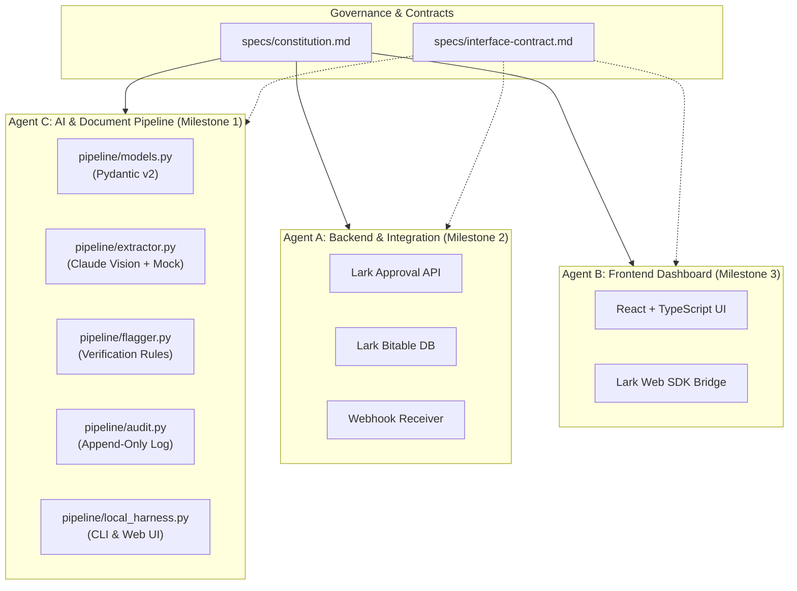

# Clearance & Last Pay Web App

[](https://www.python.org/)
[](https://fastapi.tiangolo.com/)
[](https://docs.pydantic.dev/)
[]()

> Companion web app embedded in Lark Workplace alongside the existing *Clearance and Last Pay Approval* flow. Automates document pre-checks, eliminates manual investigation/re-keying, and flags discrepancies to accelerate approver turnaround toward a 5–7 day target.

---

## 🛡️ Core Constitutional Guardrails

Per [`specs/constitution.md`](specs/constitution.md):
1. **AI NEVER auto-approves**: The AI pre-checks, extracts, and flags. A human approver always finalizes every approval/rejection decision.
2. **Immutable Audit Trail**: Every AI pre-check, document hash, and human override is recorded in an append-only audit log.
3. **RBAC at the API Layer**: Role-based access control is enforced at the backend endpoint level, not just hidden in the UI.
4. **Zero Credential Exposure**: No production tokens, keys, or secrets are ever committed or logged.

---

## 🏛️ Architecture & Multi-Agent Structure

This project follows **Spec-Driven Development (SDD)** with 3 specialized agents:



---

## 🚀 Quick Start (Local Test Harness)

### 1. Installation
```powershell
# Clone the repository
git clone https://github.com/markwlsn/clearance-last-pay-app.git
cd clearance-last-pay-app

# Install dependencies
pip install -r requirements.txt
```

### 2. Run the Interactive Web Harness
```powershell
python -m pipeline.local_harness --web --port 8000
```
Open **`http://localhost:8000`** in your browser to:
- Test synthetic fixtures with 1-click.
- Upload any Quit Claim, Bank proof, or Clearance sheet.
- Inspect real-time discrepancy flags and confidence scores.
- View live append-only audit records.

### 3. Run via CLI Batch Runner
```powershell
# Valid Quit Claim
python -m pipeline.local_harness --file samples/quit_claim_valid.pdf --type QUIT_CLAIM

# Mismatched Quit Claim (flags amount mismatch and missing signature)
python -m pipeline.local_harness --file samples/quit_claim_mismatch.pdf --type QUIT_CLAIM

# Invalid Bank Format (flags account number pattern mismatch)
python -m pipeline.local_harness --file samples/bank_bad_format.png --type BANK_ENROLLMENT
```

### 4. Run Automated Test Suite
```powershell
pytest tests/
```
All **23 unit and integration tests** execute deterministically without external credentials.

---

## 📂 Repository Structure

```text
├── pipeline/                   # Agent C: Document extraction & pre-check engine
│   ├── __init__.py
│   ├── models.py               # Pydantic v2 schemas matching interface-contract.md
│   ├── flagger.py              # Rule-based discrepancy flagger (amounts, formats, sigs)
│   ├── audit.py                # Append-only SHA-256 structured audit logger
│   ├── extractor.py            # Claude API vision + deterministic mock provider
│   └── local_harness.py        # Dual CLI runner and FastAPI web dashboard
├── samples/                    # 6 synthetic test fixtures (clean & flawed)
│   ├── quit_claim_valid.pdf
│   ├── quit_claim_mismatch.pdf
│   ├── bank_gcash_valid.png
│   ├── bank_bad_format.png
│   ├── clearance_sheet_valid.pdf
│   └── clearance_missing_it.pdf
├── scripts/
│   └── generate_samples.py     # Reproducible fixture generator (ReportLab + Pillow)
├── specs/                      # Spec-Driven Development documents
│   ├── constitution.md         # Project constitution (Phase 0)
│   ├── interface-contract.md   # Cross-agent interface contract v0.1.0
│   ├── 001-doc-extraction-local-test/ # Milestone 1 (requirements, design, tasks)
│   ├── 002-backend-integration/       # Agent A design
│   └── 003-frontend-dashboard/        # Agent B design
├── tests/                      # 23 automated tests (pytest)
│   ├── test_schemas.py
│   ├── test_flagger.py
│   ├── test_audit.py
│   ├── test_extractor.py
│   └── test_pipeline_e2e.py
├── clearance-last-pay-webapp-readme.md # Multi-agent kickoff brief
├── spec-driven-development.md          # SDD Playbook v1.0
├── requirements.txt
└── .env.example
```

---

## 📜 Development Workflow

This repository adheres strictly to **Spec-Driven Development (SDD)**:
- **Phase 0**: Constitution definition
- **Phase 1**: Intake & Clarify
- **Phase 2**: EARS Requirements (`requirements.md`)
- **Phase 3**: Technical Design (`design.md`)
- **Phase 4**: Task Breakdown (`tasks.md`)
- **Phase 5**: Test-Driven Implementation Loop (Checkpoint mode)
- **Phase 6**: Validation & Acceptance
