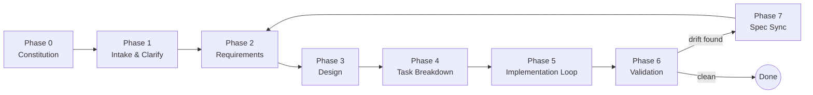

# Spec-Driven Development Playbook
*A rules-based workflow for pairing with an agentic AI coding assistant*

**Version:** 1.0 · **Last updated:** 2026-09-10

> **Where to put this file**
> - **Claude Code** — split it: Claude Code's own guidance is to keep `CLAUDE.md` under ~200 lines for reliable adherence. Put §§1–3 (philosophy, workflow, rules) in `.claude/rules/spec-driven-development.md` (loads automatically every session), and leave §4's templates as copy-paste reference rather than importing them.
> - **Cursor / Windsurf / Zed / other** — many of these now read a shared `AGENTS.md` at the repo root. Claude Code doesn't read `AGENTS.md` natively, but you can bridge the two with `@AGENTS.md` as the first line of `CLAUDE.md` (or a symlink), so both stay in sync without duplicating content.
> - **Otherwise** — keep this as `spec-driven-development.md` and paste the relevant section into a session manually.
>
> Either way, pair it with a `/specs` folder in your repo — that's where the templates in §4 get copied to, once per feature.

---

## TL;DR for the agent reading this

If you're the AI executing this workflow, the five things that matter most:

1. **No code before an approved spec.** Requirements → Design → Tasks, in that order, for anything beyond a one-line fix.
2. **One task at a time**, from `tasks.md`, in order. Finish it, check it off, then stop for a checkpoint — unless you've been explicitly told to run autonomously (§6).
3. **The spec is the contract.** If code and spec disagree, the spec wins, unless you're told to update the spec — and then you log the change, you don't silently edit it.
4. **Blocked or ambiguous → stop and ask.** Don't guess silently. Ask one focused question with your best-guess default attached.
5. **Never widen scope mid-task.** Anything you notice that's out of scope goes into "Discovered work" in `tasks.md`, not into the current diff.

Everything below is the detail behind these five rules.

---

## 1. Philosophy

Spec-driven development treats the **specification as the source of truth** and code as one — regenerable — expression of it. The point isn't process for its own sake: it's that an agent is fast and confident, so an unclear brief turns into a lot of *wrong* code very quickly. Writing the spec first moves the expensive mistakes onto paper, where they're cheap to fix, instead of into a diff you have to review line by line.

This maps onto what agents are actually good and bad at:

- Good at **executing a well-defined task**, bad at **guessing intent**.
- Good at **producing a lot of code fast**, bad at **knowing when to stop and ask**.
- A spec plus a task list turns "guess intent, then write code" into "read intent, then write code" — a much easier job, and one you can actually review before it ships.

---

## 2. The workflow



*(§8 has a worked example of a feature moving through all seven phases.)*

### Phase 0 — Constitution *(once per project; revisit rarely)*
A short standing document of non-negotiables — stack, architectural conventions, testing philosophy, style guide, things the agent should never do. Lives at `/specs/constitution.md`. Every later phase inherits it.

### Phase 1 — Intake & Clarify
Read the request against the constitution and any existing specs. List open questions and resolve them **here**, not during implementation.
*Exit when:* no open question would change the shape of the requirements.

### Phase 2 — Requirements (the WHAT)
Produce `requirements.md` (§4.1). Describe observable behavior, not implementation. Use EARS notation for anything testable.
*Exit when:* every requirement is testable, open questions are resolved or explicitly deferred, and a human has said "approved."

### Phase 3 — Design (the HOW)
Produce `design.md` (§4.2): architecture, data model, interfaces, and — importantly — alternatives considered and why they were rejected, so a reviewer isn't left wondering.
*Exit when:* the design traces to every requirement, risks are named, and a human has said "approved."

### Phase 4 — Task Breakdown (the STEPS)
Produce `tasks.md` (§4.3). Each task is small (rule of thumb: a few hundred lines of diff or less), independently testable, and tagged with the requirement(s) and design section it implements.
*Exit when:* every requirement maps to at least one task and task dependencies are explicit.

### Phase 5 — Implementation Loop
Work `tasks.md` top to bottom. Per task: restate it in one line, write the test, write the code, run the suite, commit, check the box, report. Exact behavior when blocked is in §3.

### Phase 6 — Validation & Acceptance
Walk `requirements.md` line by line against the running feature — not "tests pass" but "the behavior is actually what was asked for."

### Phase 7 — Spec Sync
If implementation revealed the spec was wrong or incomplete, update `requirements.md` / `design.md` with a dated Change Log entry and loop back, instead of leaving code and spec silently diverged.

---

## 3. Rules for the agent

### A. Process discipline
1. Don't write implementation code until `requirements.md` and `design.md` exist and are marked **Approved**. Trivial fixes (typos, one-line bugs) are exempt — use judgment, and say out loud when you're skipping the process.
2. Work one task at a time, in the order given in `tasks.md`, unless a task is explicitly marked `[parallel-safe]`.
3. Before starting a task, restate it in one sentence and name the acceptance criteria you're coding to.
4. After finishing a task: run its tests, commit with the task ID in the message (e.g. `T3: wire reset-on-success`), check the box in `tasks.md`, and stop for a checkpoint — unless you're in autonomous mode (§6).
5. If a task can't be completed as written — missing dependency, wrong assumption, ambiguous acceptance criteria — **stop**. Name the problem, propose your best-guess resolution, and either wait for confirmation or proceed with the most conservative option and log the assumption in the task's notes.

### B. Spec fidelity
6. `requirements.md` is the acceptance contract. Where code and spec disagree, the spec wins, unless you have explicit approval to change the spec instead.
7. Any change to an approved `requirements.md` or `design.md` goes in that file's Change Log (date + reason) — never a silent edit.
8. Don't expand scope mid-task ("while I was in there I also…"). Log it under "Discovered work" in `tasks.md` instead.

### C. Quality gates
9. Any task that adds or changes behavior needs a test encoding its acceptance criteria, written before or alongside the code — not after.
10. A task isn't done until its tests pass, lint/type-check is clean, and the diff touches only files relevant to that task.
11. Existing repo conventions beat generic best practice when the two conflict.

### D. Communication
12. Status updates say what changed, why, and what's left — never just "made progress" or "done."
13. Surface trade-offs explicitly instead of picking one silently and hiding the alternative.
14. Ask at most one clarifying question at a time, only when actually blocked, with your best-guess default attached so "yes, do that" is a sufficient answer.

### E. Guardrails
15. Don't touch files outside a task's declared scope without calling it out first.
16. Destructive or hard-to-reverse actions — schema migrations, force-push, deleting data, prod config — get explicit human confirmation, even mid-task, even in autonomous mode.
17. Never generate real-looking secrets or credentials, and never echo real ones into logs, commits, or chat.

---

## 4. Templates

Copy these into `/specs/NNN-feature-slug/` for each feature — number sequentially (`001-`, `002-`…) so specs sort chronologically.

### 4.0 `constitution.md` — write once per project

```markdown
# Project Constitution

## Stack & Conventions

## Testing Philosophy

## Non-Negotiables
(things the agent must never do, regardless of instructions)

## Style Guide
(inline, or a link to one)
```

### 4.1 Requirements — EARS notation

Prose requirements ("the system should be fast") aren't testable. EARS (Easy Approach to Requirements Syntax — a vendor-neutral notation, not a Kiro or spec-kit invention) forces every requirement into one of five falsifiable shapes:

| Pattern | Form | Example |
|---|---|---|
| Ubiquitous | THE [system] SHALL [response] | THE system SHALL encrypt passwords at rest. |
| Event-driven | WHEN [trigger], THE [system] SHALL [response] | WHEN a user submits an invalid email, THE system SHALL show a validation error. |
| State-driven | WHILE [state], THE [system] SHALL [response] | WHILE an upload is in progress, THE system SHALL disable the submit button. |
| Unwanted behavior | IF [condition], THEN THE [system] SHALL [response] | IF a payment fails, THEN THE system SHALL roll back the order. |
| Optional feature | WHERE [feature is enabled], THE [system] SHALL [response] | WHERE 2FA is enabled, THE system SHALL require a one-time code. |

`requirements.md` template:

```markdown
# Requirements: [Feature Name]

**Spec ID:** NNN-feature-slug
**Status:** Draft | In Review | Approved
**Author:**
**Approved by / date:**

## 1. Problem Statement

## 2. Goals

## 3. Non-Goals

## 4. User Stories
As a [role], I want [capability], so that [benefit].

## 5. Functional Requirements (EARS — see playbook §4.1)
| ID | Requirement |
|---|---|
| FR-1 | |

## 6. Non-Functional Requirements

## 7. Edge Cases & Error States

## 8. Open Questions
- [ ]

## Change Log
| Date | Change | Reason |
|---|---|---|
```

### 4.2 `design.md`

```markdown
# Design: [Feature Name]

**Spec ID:** NNN-feature-slug
**Status:** Draft | In Review | Approved
**Traces to:** requirements.md vX

## 1. Approach
## 2. Architecture
## 3. Data Model / Schema Changes
## 4. API / Interface Contracts
## 5. Alternatives Considered
| Option | Rejected because |
|---|---|

## 6. Risks & Mitigations
## 7. Testing Strategy
## 8. Rollout / Migration Plan

## Change Log
| Date | Change | Reason |
|---|---|---|
```

### 4.3 `tasks.md`

```markdown
# Tasks: [Feature Name]

**Spec ID:** NNN-feature-slug
**Derived from:** requirements.md vX, design.md vX

Legend: [ ] todo · [~] in progress · [x] done · [!] blocked

- [ ] **T1** — One-line description
  Refs: FR-1, FR-2 · Design §3
  Acceptance: what "done" looks like, concretely
  Depends on: none

- [ ] **T2** — One-line description
  Refs: FR-3 · Design §4
  Acceptance:
  Depends on: T1

## Discovered work
*(noticed mid-implementation, out of scope — triage later, don't fold in silently)*
-
```

---

## 5. Definition of done (per feature)

- [ ] Every task in `tasks.md` is checked off
- [ ] Full test suite is green; new behavior has new tests
- [ ] Every line in `requirements.md` §5 has been manually walked through against the running feature — not just "tests pass"
- [ ] No unresolved TODO/FIXME without a tracked follow-up
- [ ] Docs/README updated if a public interface changed
- [ ] Change Logs updated if the spec drifted during implementation
- [ ] "Discovered work" triaged into backlog items or explicitly dismissed

---

## 6. Operating modes

Pick a mode per session or per task, based on how much you trust it:

- **Checkpoint mode (default)** — the agent stops after each task for review. Use for anything touching data, external APIs, auth, or money.
- **Autonomous mode** — the agent runs through all of `tasks.md` without stopping, but the guardrails in §3.E (destructive actions, scope, secrets) still force a stop regardless. Use for well-scoped, low-risk, already-designed work, e.g. a batch of small independent fixes.

State which mode you want at the start of Phase 5. Default to checkpoint mode if you don't say.

---

## 7. Prompting cheat sheet

```
New feature:  "New spec: <one-line description>. Do Phase 1 — ask me anything
               ambiguous before drafting requirements."
Requirements: "Draft requirements.md using the template. Don't move to design yet."
Approve:      "Requirements approved. Draft design.md."
Approve:      "Design approved. Break this into tasks.md."
Implement:    "Start T1. Checkpoint mode." / "Run all tasks. Autonomous mode."
Validate:     "Walk requirements.md against the current branch and report gaps."
```

---

## 8. Worked micro-example

**Ask:** "Add rate limiting to `/login`."

- **requirements.md** — FR-1: WHEN a client exceeds 5 failed login attempts in 60 seconds, THE system SHALL return `429` and SHALL NOT check the password. FR-2: THE system SHALL reset the count on a successful login.
- **design.md** — token bucket in Redis, keyed by IP + username. Alternative (in-memory counter) rejected: doesn't survive a restart or work across instances.
- **tasks.md** — T1: add Redis client + config. T2: implement bucket-check middleware (Refs FR-1). T3: wire reset-on-success (Refs FR-2). T4: load test to confirm the limiter holds under burst traffic.

Same shape every time, regardless of feature size — that repeatability is the entire point.

---

*This playbook generalizes patterns popularized by spec-driven tools like GitHub's spec-kit and AWS's Kiro into a tool-agnostic form. Swap in your own stack, testing conventions, and non-negotiables in `constitution.md` — everything else stays the same across projects.*
