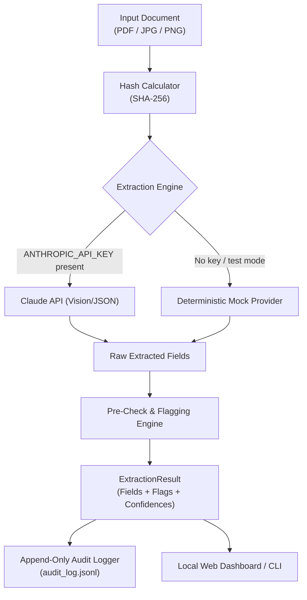

# Design: Local Document-Extraction Test Run

**Spec ID:** 001-doc-extraction-local-test
**Status:** In Review
**Traces to:** `specs/001-doc-extraction-local-test/requirements.md` (FR-1 through FR-10)
**Author:** Agent C (AI / Document Pipeline)

---

## 1. Approach

We build a modular, testable Python pipeline matching the schemas defined in `specs/interface-contract.md`. The design cleanly separates document extraction from pre-check verification and audit logging:

---

## 2. Architecture & Modules

The pipeline lives in the `pipeline/` package with clear separation of concerns:

### 2.1 `pipeline/models.py`
- Implements Pydantic v2 classes conforming to `specs/interface-contract.md` §2.
- Types: `ExtractedField[T]`, `ExtractionFlag`, `DocumentAuditMetadata`, `QuitClaimExtractionResult`, `BankEnrollmentExtractionResult`, `ClearanceSheetExtractionResult`.
- Custom validators ensuring confidence scores are bounded in `[0.0, 1.0]`.

### 2.2 `pipeline/flagger.py`
- Independent rule-based pre-check evaluator.
- Flagging rules:
  1. `FLAG_LOW_CONFIDENCE`: any field with `confidence < 0.80`.
  2. `FLAG_MISSING_FIELD`: any required field where `raw_value is None` or empty.
  3. `FLAG_AMOUNT_MISMATCH`: figures vs words numerical equivalence test.
  4. `FLAG_SIGNATURE_ABSENT`: signature boolean is `False` or confidence `< 0.80`.
  5. `FLAG_FORMAT_MISMATCH`: checks Philippine bank account number lengths (e.g. BDO: 10 or 12 digits, BPI: 10 digits, Metrobank: 13 digits, GCash/Maya: 11 digits starting with 09).
  6. `FLAG_ACCOUNTABILITY_NOTED`: any department clearance reporting outstanding equipment, cash advances, or disciplinary holds.

### 2.3 `pipeline/extractor.py`
- Strategy pattern for document extraction:
  - `ClaudeDocumentExtractor`: Uses Anthropic Python SDK with Claude 3.5 Sonnet / Haiku vision to extract structured JSON matching Pydantic schemas.
  - `DeterministicMockExtractor`: Deterministic provider keyed on file name / hash pattern. Returns realistic valid and flawed payloads for testing without API usage.
- File parser handles PDF to image conversion and MIME-type detection.

### 2.4 `pipeline/audit.py`
- Implements `AuditLogger`.
- Writes immutable, append-only JSONL entries to `logs/audit_log.jsonl`.
- Ensures zero plaintext secret storage, records processing duration, model version, and exact flag codes.

### 2.5 `pipeline/local_harness.py`
- Provides dual interface:
  1. **CLI Runner**: `python -m pipeline.local_harness --file samples/quit_claim_valid.pdf --type QUIT_CLAIM`
  2. **Web Dashboard**: `python -m pipeline.local_harness --web --port 8000`
     - FastAPI app serving a modern, responsive HTML/Tailwind interface.
     - Allows uploading files, displays extraction results, color-codes flags (green/amber/red), and lets users inspect recent audit log entries.

---

## 3. Alternatives Considered

| Option | Rejected Because |
|---|---|
| **Local Tesseract OCR + Regex** | Extremely brittle on varied bank receipts, photocopied clearance tables, and handwritten signatures. Fails on layout shifts. |
| **Combined Extractor + Flagger in single prompt** | Violates separation of concerns. If the LLM generates its own flags, it may hallucinate confidence. Separating extraction from rule-based verification guarantees deterministic enforcement of bank number patterns and amounts. |
| **Database-backed Audit Log (SQLite/Postgres) in Milestone 1** | Unnecessary dependency overhead for a local test run. JSONL is portable, zero-setup, human-readable, and trivially migratable to Bitable or Postgres in Phase 5. |

---

## 4. Risks & Mitigations

- **Risk**: User does not immediately have an `ANTHROPIC_API_KEY` configured.
  - *Mitigation*: Included `DeterministicMockExtractor` enables full execution of all automated tests and interactive web harness out-of-the-box.
- **Risk**: Philippine bank account formats vary (e.g., account numbers with/without hyphens).
  - *Mitigation*: Regex normalizer strips spaces and hyphens before length/checksum checks.

---

## 5. Testing Strategy

1. **Unit Tests (`tests/test_flagger.py`)**: Test every flagging rule against edge cases (low confidence, missing signature, mismatched words vs numbers, invalid GCash numbers).
2. **Schema Tests (`tests/test_schemas.py`)**: Verify round-trip serialization and interface contract compliance.
3. **Audit Tests (`tests/test_audit.py`)**: Verify that logs are append-only, formatted in JSONL, and never log sensitive unencrypted payloads.
4. **Integration Tests (`tests/test_pipeline_e2e.py`)**: Run synthetic sample files through the end-to-end extraction and flagging flow.

---

## Change Log

| Date | Change | Reason |
|---|---|---|
| 2026-09-18 | Initial design document created for Milestone 1 | Conforming to SDD Phase 3 |
