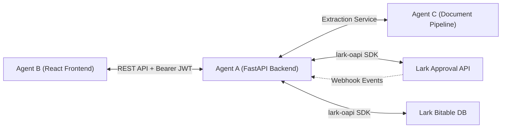

# Design: Backend & Lark Integration

**Spec ID:** 002-backend-integration
**Status:** In Review (Parallel Design Phase — No Implementation until Milestone 1 passes)
**Traces to:** `clearance-last-pay-webapp-readme.md` §2.1, §5.3, `specs/constitution.md`, `specs/interface-contract.md`
**Author:** Agent A (Backend / Integration)

---

## 1. Scope & Boundaries

- **Owns**: Lark OAuth 2.0 flow, Lark Approval API (read/write instance state), Lark Bitable schema management, Webhook event subscriptions, RBAC enforcement layer, REST API servicing Agent B.
- **Does NOT touch**: React UI components, OCR / extraction prompt engineering.
- **Strict Guardrail**: Zero direct Lark calls or production credential setup until Milestone 1 (Local Document Extraction) passes and Lark scopes are confirmed by orchestrator.

---

## 2. Architecture & Tech Stack

- **Framework**: Python 3.12 + FastAPI
- **SDK**: `lark-oapi` (official Lark OpenAPI SDK for Python)
- **Data Persistence**: Lark Bitable as primary datastore
- **Authentication**: Lark User Access Token (via OAuth / Lark Web SDK SSO) + Lark Tenant Access Token for background sync.

---

## 3. Core Capabilities (Planned)

### 3.1 Lark Approval Integration
- The app **never** creates a parallel approval path. It links directly to the existing Lark Approval definition `Clearance_and_Last_Pay_Approval`.
- Uses `approval.v4.instance.get` to read current approval progress and node status.
- Approver actions in the dashboard invoke `approval.v4.instance.approve` / `reject` with audit trails.

### 3.2 Bitable Schema Alignment
- Reflects the data structures in `specs/interface-contract.md` §4 (`clearance_dossiers`, `document_extractions_audit`, `human_decisions_audit`).
- Ensures automatic syncing of document hashes, pre-check flag summaries, and approver comments.

### 3.3 RBAC Layer
- API-level role resolution based on Lark employee identity and department:
  - `REQUESTER`: Can submit dossier and view own status.
  - `DEPARTMENT_APPROVER` (IT, Admin, Finance, HR): Can view dossiers pending their department's clearance; sensitive fields masked.
  - `FINANCE_APPROVER`: Full access to bank details, computation sheets, and payment releases.
  - `ADMIN`: Full visibility and audit log access.

---

## Change Log

| Date | Change | Reason |
|---|---|---|
| 2026-09-18 | Initial parallel design drafted | Phase 1 design scoping per README §8 |
