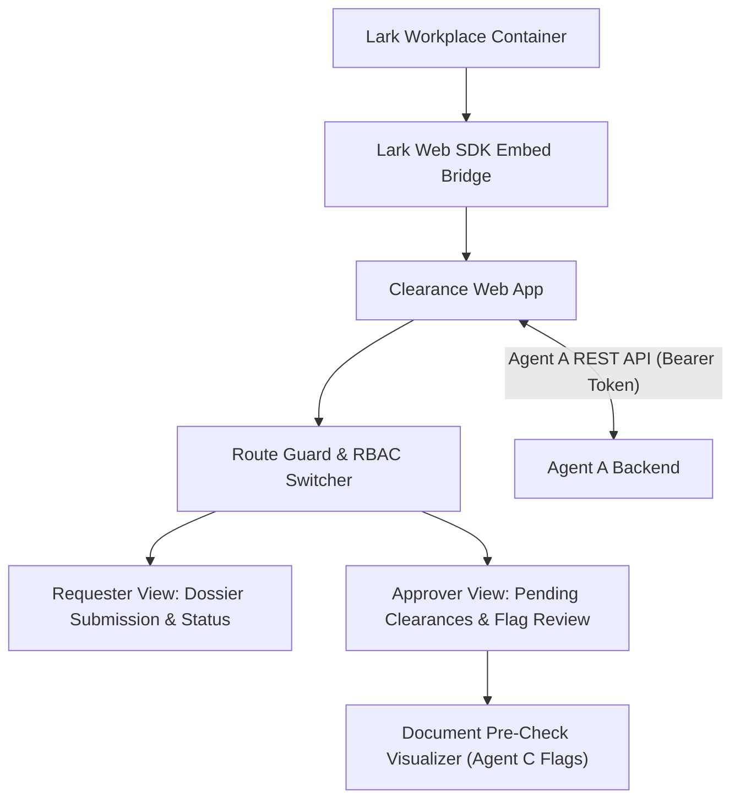

# Design: Frontend & Dashboard Architecture

**Spec ID:** 003-frontend-dashboard
**Status:** In Review (Parallel Design Phase — No Implementation until Milestone 1 passes)
**Traces to:** `clearance-last-pay-webapp-readme.md` §2.1, §5.4, `specs/constitution.md`, `specs/interface-contract.md`
**Author:** Agent B (Frontend)

---

## 1. Scope & Boundaries

- **Owns**: Requester submission form, approver review dashboard, pre-check flag visualization, Lark Web SDK embed wrapper, client-side state management, and mock API client for development.
- **Does NOT touch**: Direct Lark API calls — strictly communicates via Agent A's backend endpoints per `specs/interface-contract.md`.
- **Strict Guardrail**: Zero direct Lark API credentials in frontend code; pure functional React components + hooks.

---

## 2. Architecture & Tech Stack

- **Framework**: React 18 / 19 + TypeScript + Vite
- **Styling**: Tailwind CSS + Lucide Icons
- **SDK**: Lark Web SDK (`@lark-op/block-client` / JSSDK) for embedded iframe context & theme matching
- **State Management**: React Query (TanStack Query) for server state caching & mutation

---

## 3. Core UI Components (Planned)

### 3.1 Document Pre-Check Flag Visualizer
- Color-coded badges:
  - `Green`: Verified / Confidence $\ge 0.80$, no anomalies.
  - `Amber`: `FLAG_LOW_CONFIDENCE` or optional fields uncertain.
  - `Red`: `FLAG_MISSING_FIELD`, `FLAG_SIGNATURE_ABSENT`, `FLAG_AMOUNT_MISMATCH`, `FLAG_ACCOUNTABILITY_NOTED`.
- Side-by-side split screen: Document preview on left, structured fields and extracted values on right with one-click "Accept / Override with Comment" button.

### 3.2 Human Approval Dialog
- Enforces the constitutional requirement: Approver must actively review and check off flags before clicking **Approve** or **Reject**.
- Prompt for override justification when approving despite red/amber flags.

### 3.3 Mock Service Worker (MSW)
- Development mode uses MSW or mock adapter conforming to `specs/interface-contract.md`, allowing frontend development to proceed in parallel with backend implementation.

---

## Change Log

| Date | Change | Reason |
|---|---|---|
| 2026-09-18 | Initial parallel design drafted | Phase 1 design scoping per README §8 |
